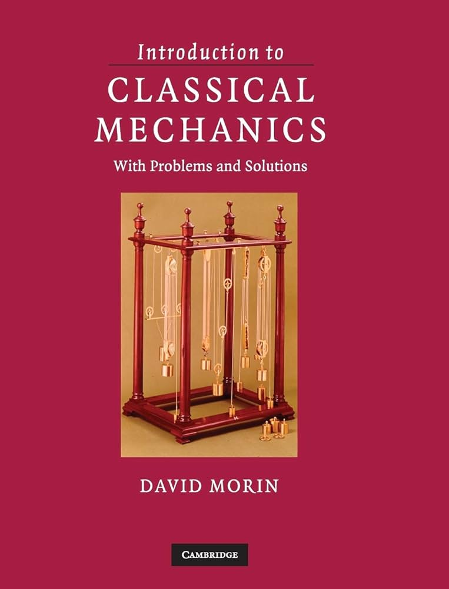

## When and where is class?

-   When: Monday, Wednesday, and Friday, 2:40PM-4:00PM
-   Where: See the course Lyceum for the classroom information

## Where do I get my textbook?

The textbook for this class is "Introduction to Classical Mechanics" by David Morin (Cambridge University Press). The library should have copies available, but you can also purchase it at the Bates bookstore.

To find the library copies, go to [librarysearch.bates.edu](librarysearch.bates.edu) and search for the course number or my name. Write down the book's call number and ask for it at the library.

{width=200}

## When are your office hours? {#officehours}

Office hours: 

-   Tuesdays 1:30PM-2:30PM
-   Wednesdays 4PM-5PM

You can also make a one-on-one meeting in calendly (see Lyceum for the scheduling link). If you schedule a one-on-one meeting, it will be in my office. The location of my office and the classroom for office hours are both in Lyceum.

## Should I go to office hours? {#goingtoofficehours}

Office hours are my open hours, when I have specifically set aside time to talk to my students (that's you!). Please always feel free to come by. You can ask questions about homework, concepts from class, projects, careers in physics, navigating the major, or anything else you want to ask. I will prioritize questions about course content, but I'm always happy to talk about other questions you might have.

## Do we have a CAT for this class? {#cat}
Yes! We do have a CAT assigned to this class. You can find that person's information and their hours in Lyceum.

## Will this class be hard? {#classdifficulty}

Learning requires hard work and a willingness to sit with discomfort, and so this class will push you out of your comfort zone. We will be combining new conceptual ideas with old mathematical tools, and there will be a lot of homework so that you have plenty of opportunities to practice. It's not meant to be a weed-out class (which are a form of unfair gatekeeping that I don't subscribe to) or to be impossible to succeed in, but it is meant to be challenging. 

I've designed the class with lots of scaffolding, but every student is different, so that doesn't mean this class will be perfectly matched to where you are every single day. If you find yourself struggling with the material, please come talk to me. We can talk through study habits and conceptual misunderstandings and mathematical challenges and make sure you have what you need to feel like you are being challenged but not overwhelmed.

## Where do I find assignment instructions/course handouts/slides? {#findstuff}

I created this website to make the syllabus and basic questions about the course easy, but not everything will be here. Handouts, in-class activities, specific assignments, and class notes will all be in the course page on Lyceum.

If you are enrolled in the class but do not have access to Lyceum, please let me know immediately so I can add you.

## When is \_\_ due? {#duedates}

You can find all due dates on the [course schedule](https://docs.google.com/spreadsheets/d/1YAsNtwv3fVJGBB0jJE1co742owqrAibKPeEpugopHsM/edit?usp=sharing). Dates are subject to change, but will always be kept up to date on the schedule so check back if you're not sure.

## Can I have an extension? {#extensionpolicy}

This course is designed with a huge amount of flexibility on due dates. Unless you have very serious extenuating circumstances, I will not be allowing any extensions or give full credit for work turned in late. You can see more about this in the [syllabus section on deadlines](syllabus.qmd#deadlines).

## Can I re-do something I did poorly on? {#revisionpolicy}

Those of you who have taken classes with me (or who have talked to classmates who have taken my classes) know that I have in the past allowed retakes and retries on various assignments. In this class, I'm not allowing retakes or retries, but I've built that room to grow into the way the grades are calculated. If you need to meet learning objectives in the "Forces and Torques" category five times, but you have eight chances to do so throughout the semester, that means that if you make some mistakes, you have a chance to earn that learning objective later. And since homework is self-assessed, you don't have to worry about missing points for making mistakes there, just for not trying in the first place. So, just like my [extension policy](#extensions), only if there are serious extenuating circumstances will I allow a retake.

If you feel strongly that you demonstrated one of the course learning objectives on a test but it was not accounted for in the rubric, please schedule a meeting with me to talk about it. Bring to that meeting the learning objective you feel you met, the work in which you feel you demonstrated that learning objective, and we can talk about it.

## What if I have to miss a test? {#testmakeups}
If you have to miss class on a test day to an approved excuse, you may take the test at the testing center. You must do this no more than 2 days before the test is given and no more than 7 days after, and you can request this option through AESS using this [form](https://www.bates.edu/accessible-education-student-support/makeup-exam-requests/). If you are not sure your absence is excused or you feel you have a special circumstance, come and talk to me about it and we will discuss the options.

## When will you reply to my email? {#emails}

I get a lot of emails every day. And just like all of you, I have a lot of expectations on me every day. I would love to respond personally to each and every email I get, but that can become quite challenging. So I will do my best to reply within two business days to emails that require a timely response, but you may not hear from me if your question already has an available answer within your reach. So before you email me, please do the following first:

- Check for emails in the class google group. I won't use this often, in order to avoid overwhelming your inbox, but time sensitive announcements will go here.
- Check the course calendar.
- Check Lyceum to see if your question can be answered there (especially if this is about assignments, handouts, course content, etc)
- Check the syllabus and FAQ. I've made it this way for a reason -- it's quickly searchable with ctrl+F, and organized with hyperlinks to make it easy to find things.
- Consider dropping by my office hours and just saying you have a quick question for me -- office hours are not just for homework help, and I'm happy to answer questions of all sorts!

## Do you grade on a curve? {#gradingcurve}

Grades are not curved; your grade depends only on your own performance. Supporting your fellow students will help every one of you, and I hope you will work together!

## Can I use Generative AI in this class? {#genAI}

I won't ban generative AI models, but I want you to be thoughtful and careful in how you use them and remember that your priority in this class is to learn. Asking someone to lift weights for you will not make you stronger, and asking Gemini to do your homework will not help you learn. Per the course [technology policy](syllabus.qmd#techpolicy), there are some restrictions on AI use in this class. Please read that policy closely before using AI, and note that violation of the policy will result in a zero on the assignment or assessment. 

## Can the syllabus change?{#changes}

Yes, under certain conditions. The schedule may change in small ways -- this will happen if there is a disruption in the schedule (e.g. I am sick and have to cancel class, a snow day prevents us from meeting, some other emergency or surprise causes class to be cancelled). More often, what will happen is we will need a little more time on a topic, and I will push other topics a day or two. I build in a number of "catch-up days" into the schedule in order to make sure that when this happens, it doesn't require a total rewrite of the class.

The syllabus may also change if we agree together as a class to cut or modify an assignment, or if I determine that the grading scheme has set the bar too high. I will never modify assignments or grading in a way that harms your grade, and if a change to either of those has you concerned, please come talk to me and we will determine together a reasonable alternative if that is needed.

Finally, I reserve the right always to modify typos, etc. If you spot one of these, let me know, so I can fix it!

Any changes to the syllabus will be documented in the [changelog](changelog.qmd)

## What should I do if I get behind on my work? {#catchingup}

First, reach out to me. It helps me to know that you are working on catching up. I am also happy to meet and help you set adjusted deadlines to get back on track.

Second, if you are feeling really overwhelmed, consider scheduling an appointment with [a learning strategies tutor](https://www.bates.edu/student-academic-support-center/learning-strategies/) at the Student Academic Support Center. Their role is to support students seeking help with time management, organization, reading, test-taking, note-taking, and other academic skills. They can help you talk through what strategies work for you, what strategies don't, and how to manage your time and energy in a more sustainable way.

Note that meeting with a learning strategies tutor is actually part of the metacognition grade in this class, so you will get some credit for doing this. If you find yourself struggling and it's after the due date for that assignment, come talk to me and we'll talk about options.

## I have academic accommodations. What should I do? {#accommodations}

I have tried to bring the concept of [universal design](https://www.washington.edu/doit/what-universal-design-0) into how I have planned and structured this course, so I hope that any accommodations you have are already built into this course (aside from extra time on tests, which can't be accommodated during class times, but you can take the tests through [Accessible Education and Student Support](https://www.bates.edu/accessible-education-student-support/requesting-services/how-to-register-for-accommodations/). However, I don't expect to have done this perfectly (as there is no such thing), so if you have need of certain accommodations that are not already provided by this class, please let me know and I will do my best to meet those needs.

## What if I need more support in this class? {#extrahelp}

The Student Academic Support Center (SASC) has lots of tutors who can help you strengthen your math skills, problem solving skills, and study skills. Please reach out to them to see how they can help, in addition to coming to my office hours, where I am more than happy to walk through problems with you.

There are also a number of resources on the course [Resources Page](resources.qmd) and I highly recommend you take a look.
