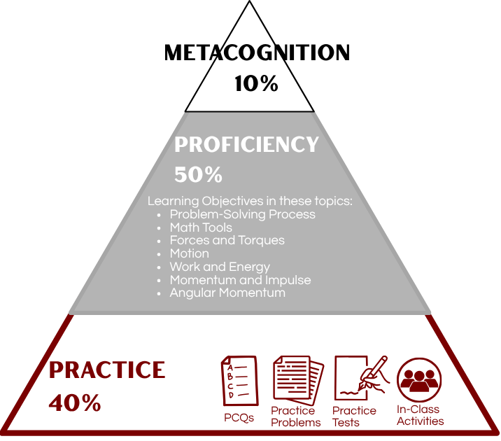

## Who is the professor?

I'm Casey Berger and this is my third year at Bates College. At Bates, I've taught PHYS 211 (Newtonian Mechanics), PHYS 216 (Computational Physics), PHYS 301 (Mathematical Methods of Physics), PHYS 308 (Introductory Quantum Mechanics), and PHYS 409 (Quantum Theory). Before Bates, I was a professor at Smith College in Physics and Statistical and Data Sciences. And long before that -- before I went to school for physics and computational science -- I went to college for philosophy, film production, and Spanish and worked in the film industry. It took me a long time to find my way to physics, but I wouldn't change any of it. The long and winding path taught me so much more about who I am, what I am capable of, and how many opportunities are available in the world. It also taught me that it's never too late to find a new passion or change your career direction.

My research involves applying high performance computing and data science techniques to many-body quantum systems, which just means studying how medium-to-large numbers of quantum objects like electrons, neutrons, or atoms interact with each other and their environment. This sounds straightforward, but unfortunately the mathematics of quantum mechanics means these problems become impossible to solve by hand and extremely challenging to solve even with high powered computers when the system is still only a few particles. 

Outside of physics, I am a person with lots of interests and hobbies. I love being outdoors in all seasons, but also love reading a book or playing board games inside with a cup of tea. Ask me for book recommendations, recipes for interesting food, or great hikes in Maine!

## Classroom expectations {#classexpectations}

::: panel-tabset
### What you can expect from me

-   I will stay home if I am feeling sick and make arrangements to deliver the course material
-   I will work with you to arrange accommodations when you need them
-   I will respect your time by starting and ending class on time
-   I will answer your questions thoughtfully, and if I don't know the answer, I will follow up in a timely manner
-   I will embrace who you are as whole people
-   I will model respect, openness, and engagement, and foster a supportive and inclusive environment
-   I will be honest when I make mistakes, because failure is part of growing

### What I expect from you

-   That you stay home if you are sick and contact me via email to arrange accommodations
-   That you be mentally present when you are in class, to the best of your ability
-   That you make a good faith effort at the work, both during and outside of class time
-   That you ask questions if you are confused (you may do this privately -- there is no obligation to ask during class hours)
-   That you communicate with me when you have problems that interfere with your ability to engage with the coursework
-   That you treat your peers with respect and openness, and that you participate in creating an inclusive, supportive, and engaged classroom

### What is not expected
-   Perfection. Ever. It's a myth.
-   That you will 'sit still' or ask for permission to leave the classroom to go to the bathroom or if you just need a minute. You're adults and I trust you to do what you need to.
-   That everyone will learn in the same way. You do not have to match some "model student" to do well in this class

:::

## Group Work {#groupwork}

I am incorporating group work in two ways throughout this class in order to cultivate a community-minded classroom, encourage a growth mindset, and build group work skills. Here is how this will work:

We will have two modules, and you will work in a team of 4-6 students for each module. Your team will work on problems in class and discuss the content together. Your active involvement in group work in class will contribute to your grade as part of the [Practice](#practicegrade) category, just as your individual homework counts.

At the end of each module, your team will write a physics problem that represents the content learned in this module. This is the [Problem Project](#problemproject) part of the [Learning Objectives](#LOgrade) category of the grade. After the first module, we will shuffle the groups, so you will have two different teams over the course of the semester.

Not all of the work will be in groups. You will also have individual tests and homework. You can work with other students on your homework, but the final work you submit must be your own.

I have tried to balance the class so that there is a mix of individual and group work, which I hope will allow everyone to get something meaningful out of the course.

## Technology Policy {#techpolicy}

### Use of LLMs {#llms}
Large Language Models and agentic AI are so ubiquitous now that it seems almost silly to say so. You are facing the great challenge of how to navigate a world filled with AI-generated information and where the advice changes from minute to minute about whether you must become an AI expert or avoid AI to succeed.

But you are also a student at Bates College, where our mission includes educating "the whole person through creative and rigorous scholarship in a collaborative residential community" and "preparing leaders sustained by a love of learning and a commitment to responsible stewardship of the wider world." And that means learning to cultivate your very human skills of creativity and critical thinking, and engaging in the productive struggle that leads to growth and learning. AI presents major challenges to all these values, from the environmental impacts of building and maintaining them and the traumatizing and exploitative nature of the labor involved in training them to the way cognitive offload reduces our capacity for independent thinking and the emotional offloading erodes our ability to live in community. 

But it is up to you, as adults, to learn how you want to exist in the world we are creating right now. So while I will not fully ban the use of AI in this course, I will ask you to proceed very thoughtfully and carefully if you do use AI, and to follow these guidelines.

1.    If you are going to use AI in any way in this class, you must **first** complete the [AI assignment in the metacognition grade category](#metacognitiongrade). This is part of your grade anyway, so it benefits you to do this. 

2.    If you use AI in any way, even just to ask a quick question and clarify something, you **must** cite your source. This means including a record of the prompt and the response, as well as one sentence discussing what you learned from this use of AI.

3.    You may **never** submit something as your own work if it was done by AI, even if you hand-copied it. Just like you wouldn't claim your classmate's work as your own, you can't claim an LLM's work either.

Violation of this policy, along any of the three requirements, will result in a zero on the assignment in question.

### Use of technology during class time {#distractions}
Technology is completely infused into our lives, and I'm not trying to convince anyone to stop using it. As a computational physicist, it's my literal vocation to use digital technology, and as a teacher, I spend many hours a day staring at my screen to write lesson plans and respond to emails. But it's important to know that as useful a tool as technology is, it can also inhibit us. 

First, the science. While we all believe ourselves to be excellent multitaskers, studies show that we can't actually focus on more than one thing at a time - what we are doing is actually rapidly task switching between one task and the next, and that [task switching takes time and energy, making us do both tasks more poorly](https://www.apa.org/topics/research/multitasking). This means that if you're toggling between your email, social media, text messages, or whatever other content might be up on your laptop, phone, or tablet in class, you are going to have a harder time learning the content in class *and* a harder time doing whatever else you are trying to do. In addition, studies have found that [merely being in the presence of our smartphones can cause us to be distracted by them](https://www.journals.uchicago.edu/doi/full/10.1086/691462). 

I have found this to be true, and as a general rule, if I'm working on something that requires my focus, such as writing a lesson plan or working on research projects, I have a box in my office that I put my phone in so I can't be distracted by it. 

Our goal in this class is to learn, and class time is an important time set aside for us to meet together in community to work towards the learning goals. In order to make sure you get the most out of that time, and to help support your classmates to not be distracted, the policy for devices is the following:

-   Phones must be on silent and out of view (to you and your classmates) throughout the duration of class
-   Laptops and tablets are *opt in* only, meaning if you wish to use one and do not already have accommodations to use one with the Office of Accessible Education, you must submit a request to use a specific device or devices in the [welcome form](https://forms.gle/NUZQSNaDPxXRTite8), along with an explanation of how each device will be conducive to your learning and how you will use it
-   If I approve laptop use, laptops may only be open during lecture and individual work time. If we are working in groups on something, your laptop must be closed so you can be fully present with your group.

Please note that there is a handy way to not only follow the course policy on cell phones, but also earn some [extra credit](#roundup), so I encourage you to take advantage of that to not only help you practice the habit of putting your phone away when it's time to focus, but also get yourself a grade boost.

One final note: I recognize that sometimes we have situations that require us to be reachable, so if you have a special circumstance that means you need to be able to take a call when it comes in or receive an email notification, please talk to me about an exception to the policy.

## Class Recording Policy {#recording}

In line with our shared values around Academic Integrity and Conduct as articulated in the Student Code of Conduct, the Dean of Faculty office reminds all students that screen capturing or making audio/video recordings of synchronous or asynchronous meetings, lectures, discussions, course materials, or other classroom activities without the prior knowledge and consent of all parties is prohibited. This applies to the use of tape or digital recorders, cell phones, smartphones, computers, and other devices capable of creating a screen capture or making audio/video recordings. Likewise, the editing, sharing, or use of recorded or digitally shared course content outside of their assigned or intended purpose is also prohibited. Students with disabilities who wish to record classroom activity should contact the Office of Accessible Education for information about appropriate protocols.

## Assignments and Grading {#assignments}
There are three main categories for grade items in this class: 

1. [Practice](#practicegrade): This work is low-stakes work intended to prepare you for the assessments in this class. It includes pre-class quizzes on the reading, a variety of homework problems, and in-class group work. This will make up 50% of your final grade.

2. [Proficiency](#LOgrade): Another 40% of your grade will be made up of 7 bundles of learning objectives. You will have opportunities to demonstrate your proficiency in these learning objectives through in-class tests and the problem projects.

3. [Metacognition](#metacognitiongrade): One of the most important skills you will learn in college is how to learn. This is called metacognition, and I have built into the grade in this class a chance to practice these metacognitive skills. 10% of your final grade will come from the metacognition assignments in this category. 

{width=300}

### Practice {#practicegrade}
Almost half of your grade will be made up of a collection of work I am calling "Practice." This includes reading the textbook and completing a pre-class reading quiz, solving problems and reflecting on your work, and taking timed practice tests to help you prepare for the in-class assessments. 

*For every assignment in the Practice category, the late policy is the same. Work done before the due date will receive full credit. All work done after the due date will receive half credit.*

This is the base of the learning pyramid, and so there is a lot of work in this category.

There will be 200 total points available in the Practice category, but the maximum grade you can achieve is 150 points. There are more points available than you need, so you can make some choices about what you want to put your energy into.

::: panel-tabset
#### Pre-Class Quizzes {#pcqs}
These are simple, 8-question multiple choice quizzes based on the reading, intended mostly to strengthen your retention of what you read. These are due at 1PM on the day of class, and there will be 18 PCQs throughout the semester.

*NOTE: PCQs are the only item in the "Practice" category which has a hard deadline. The quizzes close at 1PM the day of class and cannot be re-opened. But PCQs are a small portion of the category (max 36 points) so don't sweat missing a few.*

#### Warm-up Problems {#warmup}
These are a small set of problems selected for each week of new content (there are no warm-up problems during [Problem Project](#problemproject) weeks). There will be 2-3 warm up problems for each week, and I recommend you start with these. If you find them too easy, move on to the challenge problems.

When you complete a problem, you can submit it on Lyceum. Once you do that, the solution will become available. You should check the solution against your own work and then fill out the reflection form for that problem in Lyceum. 

*You will only get credit for a problem if you both submit a good faith attempt at the solution and fill out the reflection form.*

#### Challenge Problems {#challenge}

These are a small set of problems selected for each week of new content (there are no warm-up problems during [Problem Project](#problemproject) weeks). There will be 3-4 challenge problems for each week, and you should expect them to be challenging. If you are having a hard time with these, I recommend spending more time with the warm-up problems first, and once you feel comfortable with those, I recommend bringing your questions to office hours.

When you complete a problem, you can submit it on Lyceum. Once you do that, the solution will become available. You should check the solution against your own work and then fill out the reflection form for that problem in Lyceum. 

*You will only get credit for a problem if you both submit a good faith attempt at the solution and fill out the reflection form.*

#### Practice Tests {#practicetest}

I have designed one practice test for each test you will take in class. These are meant to be similar in content, length, and difficulty level to the in-class test. I recommend setting a timer and working in a distraction-free environment and with no notes aside from the course equation sheet if you want the best approximation of what the real test will be like.

Just like with the warm-up and challenge problems, submitting your work will get you the solution and a reflection form on Lyceum. This reflection form will ask you about how you felt you did on each of the learning objectives the test assessed, to help you understand how those learning objectives will appear.

*You must make a good faith attempt at the practice test compare your work to the solution and reflect in order to get credit for the practice test.*

#### In-Class Group Work {#groupproblemsolving}
Most days in class, there will be a chance for your group to solve a problem. If you are present and actively work with your team, and your team works on the problem but does not solve it, you will receive one point for that day. If you are present and actively work with your team, and your team successfully solves the problem, you will receive two points for that day.
:::

### Proficiency in the Learning Objectives {#LOgrade}
There will be seven topics with learning objectives that will be assessed in this class. Those can all be found on the [Course Content](#coursecontent) page. Each time you successfully demonstrate proficiency in a learning objective (which you can do through in-class tests and the problem project), you will earn one point towards that topic. The maximum number of points you can earn in each category is eight, but *there will be more than eight chances to achieve learning objectives in each topic.*

The topics are:

-   The Problem-Solving Process
-   Math Tools
-   Forces and Torques
-   Motion
-   Work and Energy
-   Momentum and Impulse
-   Angular Momentum

::: panel-tabset
#### In-Class Assessments {#assessments}
There will be 6 in-class assessments throughout the semester, each of which will be graded on a single-point rubric. That rubric will have a list of the learning objectives assessed by the test, and you will be graded on whether you demonstrated proficiency in that learning objective. If you are not sure how this will work, I recommend taking the first [practice test](#practicetest) as soon as possible, as that will help you see what this rubric will look like.

Each test is technically cumulative, but it will emphasize more recent topics over older ones.

There will also be a cumulative final, which I will design to contain the most-missed learning objectives across the class.

#### Problem Project {#problemproject}
At the end of each of our two modules, you and your group will spend one week designing a physics problem to test a subset of the learning objectives you have seen so far in class. 

On Monday, your group will select *up to five learning objectives across no more than three topics* to assess, and then you will draft and solve a physics problem similar to the kinds of problems we will solve in class and on the homework. 

On Wednesday, you will receive draft problems from two other groups and you will try to solve them and give feedback to those two groups.

On Friday, you will take the peer feedback you receive (from two different groups) and revise your problem. You will turn this problem in (typeset) by Monday of the next week. If the problem is clearly stated and solvable by your peers, then you will receive credit for each learning objective you selected depending on how well the problem actually assesses each learning objective.

*You must be present in class and actively involved with your team on all three days to receive credit for the learning objectives your team achieves.*

:::

### Metacognition {#metacognitiongrade}

You can earn a total of nine points towards metacognition, but you only need five to complete this category. These assignments are designed to get you thinking about how you engage with your learning.

*The due dates on these assignments are fixed in order to support the process of self-reflection and growth. If you want to do these, you must complete them by the deadline posted in Lyceum*

::: panel-tabset

#### SMART goals
This consists of three parts, each of which is worth one point.

-   Reading about SMART goals and setting one for yourself
-   Checking in with your progress mid-semester on your SMART goal (you must complete the first assignment to complete this one)
-   Reflecting on how your SMART goal went at the end of the semester (you must complete the first assignment to complete this one)

#### Learning Strategies Training
This consists of three parts, each of which is worth one point.

-   Scheduling a meeting with Eric Dyer, a learning strategies specialist, and preparing for the meeting ahead of time
-   Reflecting on your meeting with Eric and any goals you set (you must complete the first assignment to complete this one)
-   Scheduling a follow-up meeting with Eric at the end of the semester to talk about your progress on the goals you set in the first meeting (you must complete the first assignment to complete this one)

#### Reading and Self-Reflection

There are two reflection assignments, both of which must be done early in the semester:

-   Growth mindset: This is a short reading assignment on growth mindset versus fixed mindset, followed by a short reflection on when you have experienced a growth mindset before in your life. This is worth one point.
-   AI reflection: this consists of a set of readings about generative AI, followed by a short reflection on what you learned from the readings. This is worth two points, as the readings are more substantive.
:::

### Extra Credit {#roundup}
Because there is already some extra room built into your grade, there will only be one opportunity to earn extra credit in this class, and that is by turning your phone on do not disturb and placing it in a designated place every class. If you do this for 75% of class sessions, I will round your grade up after the final grade is calculated. 

## Deadlines and Late Policy {#deadlines}

There is so much flexibility in the number of points you can earn in this class, so there will be no extensions provided on practice problems, PCQs, or metacognition assignments except in case of major extenuating circumstances.
